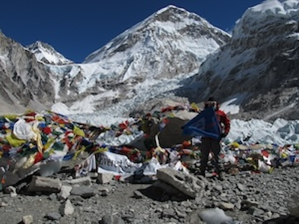
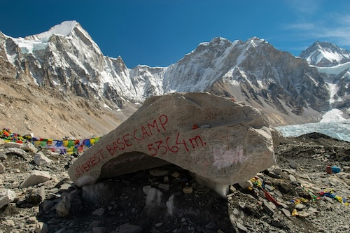

# The Archaeology Impossible Project 
 

# _Methods for Impractical Places_
## Chomolungma / Sagarmāthā / Everest

Extreme environments like Chomolungma (Mt. Everest) offer unique insights into human behavior under duress. But how do we conduct archaeology in places where archaeologists cannot physically go? 

The **Archaeology Impossible Project** translates methodologies developed for the International Space Station Archaeological Project [(ISSAP)](https://issarchaeology.org/) back to Earth. By focusing on Chomolungma, we explore human impact, neo-colonial appropriation, and the "conquest" of extreme environments through the lens of contemporary digital archaeology.

---

### Project Objectives
We have three goals:

+ **Quantifying/Qualifying Material Change:** Develop computer vision models to map and track material culture changes along Chomolungma's climbing routes (1920s–2020s). 
+ **Computational Synthesis:** Create a temporal knowledge graph, vector embedding models, and other machine learning outputs, to enable natural language querying of complex archaeological patterns, distant views and distant reads of this material.
+ **Knowledge Mobilization:** Design immersive "archaeogaming" experiences that translate those computational models into engaging public interfaces for further research and social impact.

---

## Theoretical Context
### The Contemporary Archive of Ascent
Historically, mountaineering has served as a Western metaphor for civilization’s triumph over nature. From the early colonial expeditions to today’s commercialized industry, the "conquest" of 'Everest' represents an ongoing performance of Western masculinity and nationalism. 

Unlike many traditional archaeological approaches, which foreground excavation, this project treats the mountain as a bounded environment, much like the International Space Station, where human engagement leaves distinct material signatures despite the impracticality of physical fieldwork. Like outer space, humans have no real business 'inhabiting' the high altitudes of Chomolungma. So what do these societies look like, archaeologically?

_Photo Robert Kearn, Litter trash rubbish garbage junk at Mount Everest Base Camp - South (Nepal) 2012, [wikimedia commons](https://commons.wikimedia.org/wiki/File:Everest_Base_Camp_South_Nepal_2012_02.jpg), creative commons 3.0_

---

## Methodology: The Three-Phase Pipeline

This project is funded by a SSHRC Insight Grant, terminating in 2031.

### Phase I: The Digital Fieldwork
We aggregate data from archival expedition photography, climbing literature, and public social media posts. Using **Segment Anything (SAM)** or similar approaches and custom computer vision models, we identify equipment, shelter, waste, and infrastructure across decades of imagery, geolocating photos and views.

### Phase II: The Computational Lab
Data is ingested into a **Temporal Knowledge Graph**. This is then transformed via neural networks into **Vector Embedding Models**. This allows researchers to ask "fuzzy" queries like:
*   *"What material culture patterns correlate with expedition commercialization?"*
*   *"How has the visual construction of 'climber identity' shifted since 1953?"*

### Phase III: Archaeogaming & Immersion
To move beyond static text, we utilize **Gaussian Splatting** and VR to create immersive environments _representing the data over time, not the geography_. These "data-driven" spaces will be where virtual environments represent underlying patterns of human-environment interaction.

### Student Engagement
We intend to involve students in the MA History, Digital Humanities, and Data Sciences streams at Carleton University in this research. We may also have opportunities for PhD students in Digital History / Public History. We may also recruit a postdoctoral colleague in the area of data visualization (phase III activities). Watch this space.

---

## Significance & Future Applications
Computer vision has been deployed in a number of archaeological contexts. Drawing on the work of the [International Space Station Archaeological Project](https://issarchaeology.org/) we deploy it here as our primary means of examining the 'site' and its changes over time, a place that we are unlikely ourselves to ever be able to visit. 

This project expands archaeological possibilities by demonstrating how computational methods can study contemporary material culture in physically inaccessible environments. It pushes the integration of computer vision, knowledge graphs, embedding models, and immersive communication within archaeological practice, creating new pathways for research in extreme environments globally.

We aim to reveal the material signatures of Western neo-colonization and commercialization on Everest. Douglas Freshfield wrote in 1926 that mountaineering had helped other sciences—and then asked, ‘why not archaeology?’ So here we are. The methodological innovations developed here could be applied to other extreme environments from polar research stations to disaster zones, expanding archaeology's capacity to study human-environment relationships under stress.

The immersive communication methods will develop new approaches to archaeological knowledge mobilization, demonstrating how computational models can be translated into engaging experiences that foster public understanding of environmental and colonial issues. We aim to address critical gaps in how archaeological knowledge reaches broader audiences and mobilizes action on contemporary challenges.

Results will contribute to mountaineering history, environmental anthropology, digital humanities, and policy discussions about managing human impacts in extreme environments. The project establishes computational archaeology as a viable approach for studying contemporary material culture while developing practical tools for understanding human adaptation under environmental stress. These experiences aim to foster “enchantment” in the political theorist Jane Bennett’s sense (2001) and Perry’s archaeological application (2019): moving people into action through engagement with material evidence of environmental exploitation and neo-colonial appropriation.

## People & Support

**Principal Investigators:** [Dr. Shawn Graham (Carleton U)](https://shawngraham.github.io) & [Dr Justin Walsh (Chapman U)](https://www.chapman.edu/our-faculty/justin-walsh.aspx)

**Collaboratory:** [The XLab at Carleton University](https://carleton.ca/xlab/)

**Contact us:** archaeology.impossible@gmail.com

**Acknowledgements** This project draws on research supported by the Social Sciences and Humanities Research Council of Canada.

_Photo by <a href="https://unsplash.com/@globaladventure1998?utm_source=unsplash&utm_medium=referral&utm_content=creditCopyText">Rajan Dahal</a> on <a href="https://unsplash.com/photos/a-large-rock-with-writing-on-it-in-front-of-a-mountain--I64We8WuBs?utm_source=unsplash&utm_medium=referral&utm_content=creditCopyText">Unsplash</a>_
      

